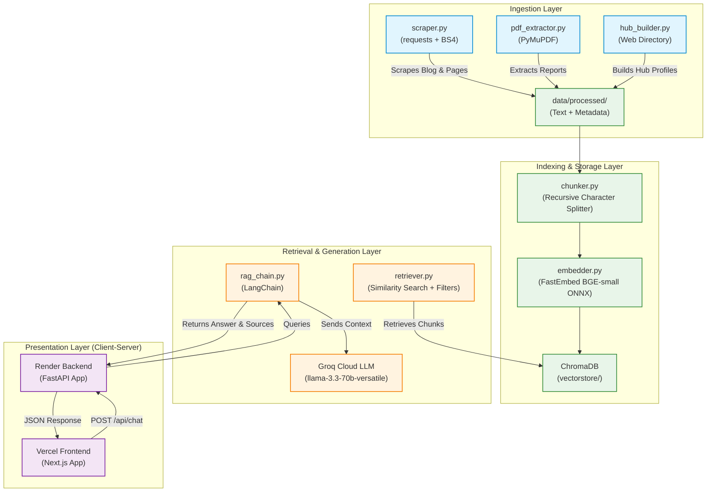

# AfriLabs AI — Africa's Wisdom Assistant

AfriLabs AI is a RAG-powered chatbot designed for **AfriLabs**, Africa's largest network of 500+ innovation hubs across 53 countries. AfriLabs AI helps users query and gain insights from AfriLabs' programs, ecosystem reports, member hubs, blog content, and funding opportunities.

## Live Deployments

- **Frontend (Next.js + Vercel)**: [https://afrilabs-ai.vercel.app/](https://afrilabs-ai.vercel.app/)
- **Backend (FastAPI + Render)**: [https://afrilabs-ai.onrender.com](https://afrilabs-ai.onrender.com)

## Tech Stack Overview
This implementation uses:
- **Local Embeddings** (FastEmbed BGE-small-en-v1.5) — runs on a lightweight ONNX runtime without PyTorch (fits under 512MB RAM, 100% free)
- **Groq API** (llama-3.3-70b-versatile) for fast LLM inference
- **ChromaDB** for persistent vector storage
- **Next.js & TypeScript** for the premium frontend UI
- **FastAPI** for the backend API server
- **LangChain** for RAG orchestration

## Features

- Scrapes AfriLabs blog posts and static pages
- Extracts text from PDF reports using PyMuPDF
- Builds member hub profiles from the AfriLabs members directory
- Chunks and embeds all content locally using HuggingFace embeddings
- Stores vectors in ChromaDB for fast similarity search
- Uses Groq's Llama 3 70B model for question answering
- Provides source citations for all answers
- Clean, responsive Streamlit UI

## Folder Structure

```
afrilabs-ai/
├── data/
│   ├── raw/
│   │   ├── blog/
│   │   ├── reports/
│   │   ├── programmes/
│   │   └── hubs/
│   └── processed/
│       ├── blog/
│       ├── reports/
│       ├── programmes/
│       ├── hubs/
│       └── metadata.json
├── vectorstore/
├── src/
│   ├── scraper.py
│   ├── pdf_extractor.py
│   ├── hub_builder.py
│   ├── chunker.py
│   ├── embedder.py
│   ├── retriever.py
│   └── rag_chain.py
├── app/ (Streamlit Web App)
│   ├── main.py
│   ├── components.py
│   └── assets/
├── frontend/ (Next.js React Frontend)
│   ├── public/
│   ├── src/
│   │   ├── app/
│   │   └── components/
│   ├── package.json
│   └── next.config.ts
├── tests/
│   ├── test_retrieval.py
│   └── eval_report.py
├── backend.py (FastAPI Backend Server)
├── requirements.txt
├── .env
├── .gitignore
└── README.md
```

## Setup & Running Guide

### 1. Clone & Set Up Directory
Open your terminal inside the workspace directory.

### 2. Create and Activate Virtual Environment
```bash
# Create environment
python -m venv .venv

# Activate environment (Windows)
.venv\Scripts\activate

# Activate environment (macOS/Linux)
source .venv/bin/activate
```

### 3. Install Dependencies
```bash
pip install -r requirements.txt
```

### 4. Configure Environment Variables
Create a file named `.env` in the root folder with:
```env
GROQ_API_KEY=your_groq_api_key_here
```
Get your free API key from [console.groq.com](https://console.groq.com/)

### 5. Run the Ingestion & Indexing Pipeline
Execute these commands in order from the project root directory:

```bash
# 1. Scrape Blog & Static pages
python src/scraper.py

# 2. Extract PDF reports text (place PDFs in data/raw/reports/ first)
python src/pdf_extractor.py

# 3. Scrape Member Hubs and build documents
python src/hub_builder.py

# 4. Chunk processed documents
python src/chunker.py

# 5. Embed chunks and save to ChromaDB
python src/embedder.py --force
```

### 6. Launch Streamlit UI
```bash
streamlit run app/main.py
```

## Usage

Once the application is running:
1. Open your browser to http://localhost:8501
2. Ask questions about AfriLabs in the chat interface
3. View answers with source citations
4. Expand the sources section to see detailed source information

## Example Questions

- What is the AfriLabs Capacity Building Programme (ACBP)?
- Which innovation hubs are located in East Africa?
- What are the main findings in the 2024 AfriLabs Impact Report?
- How can my hub join the AfriLabs network?
- What initiatives does AfriLabs have for female founders? (e.g. RevUp Women)
- What is AfriLabs' annual gathering called?
- How many innovation hubs are in the AfriLabs network?

## Evaluation

To run the retrieval evaluation suite:
```bash
python tests/test_retrieval.py
```

To view and generate the evaluation precision report:
```bash
python tests/eval_report.py
```
This generates the summary test file at `tests/eval_results.txt`.

## Architecture

AfriLabs AI follows a decoupled Client-Server RAG (Retrieval-Augmented Generation) architecture:



### Flow Breakdown:
1. **Data Ingestion & Processing**: Web scrapers and extractors output cleaned text and metadata to `data/processed/`.
2. **Indexing**: Chunks are processed and embedded locally using FastEmbed and stored in a persistent ChromaDB instance.
3. **Retrieval**: When a query comes in, the retriever fetches relevant context matching the query.
4. **Generation**: The RAG chain feeds the retrieved context and user query into the Groq-hosted Llama 3 70B model to generate an answer with source citations.
5. **Presentation**: The Next.js frontend (deployed on Vercel) calls the FastAPI backend (deployed on Render), providing a premium, interactive chat user interface.

## Technology Stack

- **Language**: Python 3.11+ (Backend), TypeScript / React (Frontend)
- **Frontend Framework**: Next.js v15
- **Backend API**: FastAPI + Uvicorn
- **LLM Orchestration**: LangChain v0.2+
- **Embeddings**: FastEmbed `BAAI/bge-small-en-v1.5` (ONNX Runtime, local, no PyTorch)
- **LLM**: Groq API (llama-3.3-70b-versatile)
- **Vector Database**: ChromaDB (persistent, local)
- **Alternate UI**: Streamlit (under `app/`)
- **Web Scraping**: requests + BeautifulSoup4
- **PDF Processing**: PyMuPDF (fitz)
- **Environment**: python-dotenv

## Notes

- The first time you run `src/embedder.py`, it will create the vector store. Subsequent runs will skip re-embedding if the vector store already exists.
- To force re-embedding, delete the `vectorstore/` directory before running `embedder.py`.
- PDF reports must be manually downloaded from [AfriLabs Ecosystem Insights](https://www.afrilabs.com/ecosystem-insights/) and placed in `data/raw/reports/`.
- The application is designed to be extensible - you can add new data sources by creating new ingestion scripts following the same pattern.